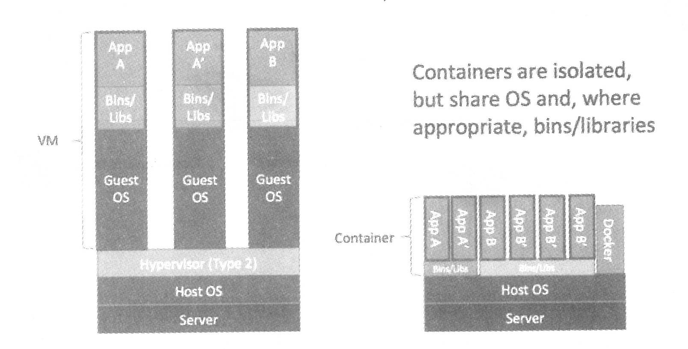

- 所有容器共享同一个 Host OS
    
- Docker 将集装箱思想运用到软件打包上，可以将任何应用及其依赖打包成一个轻量级、可移植、自包含的容器
- Docker 采用 Client/Server 架构
    - 客户端也可以通过 socket 或 REST API 与远程服务器通信
        - 默认情况下 Docker daemon 只能相应来自本地 Host 的客户端请求，需编辑配置文件更改
        - `docker -H 192.168.9.127 info` 与远程服务器通信
- `systemctl status docker.service`
- 可将 Docker 镜像看成只读模板