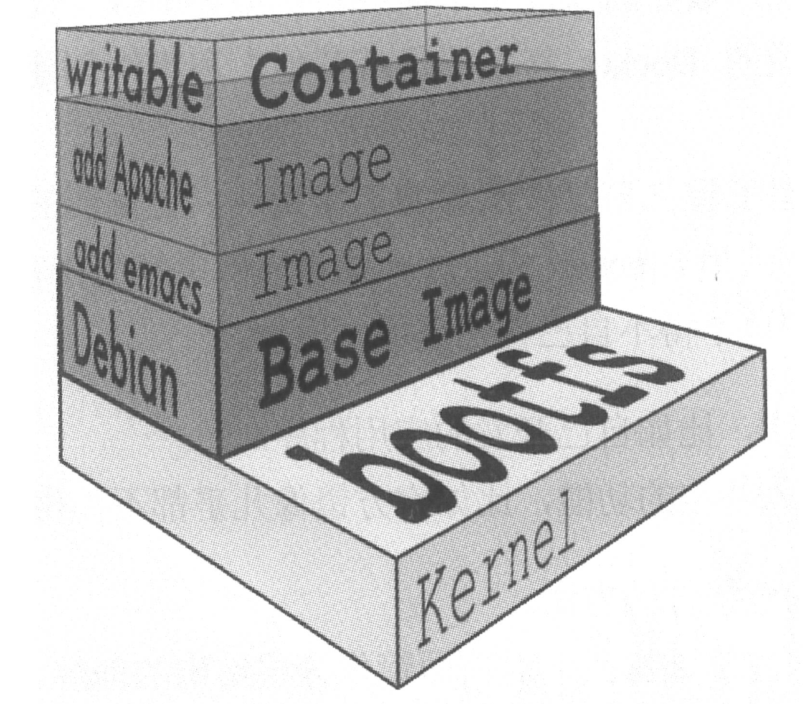

- `docker pull` 下载镜像
- base 镜像：不依赖其他镜像，从 scratch 构建，其他镜像以之为基础进行扩展
    - 通常是各种 Linux 发行版的 Docker 镜像
- Linux 的操作系统由内核空间和用户空间组成
    - 内核空间是 kernel，Linux 启动时会加载 bootfs 文件系统，之后 bootfs 会被卸载
    - 用户空间的文件系统是 rootfs，包括 /dev、/proc、/bin 等目录
    
- 对于 base 镜像，底层直接用 Host 的 kernel，自己只需提供 rootfs
- 不同 Linux 发行版的区别主要是 rootfs
    
- base 镜像只是在用户空间与发行版一直，kernel 版本与发行版不同，而是与 Host 的 kernel 一致
- 所有的容器都共用 Host kernel
    - 若容器对 kernel 版本有要求，则不适合使用，此种场景更适合使用虚拟机
- 可在 Docker Hub 的镜像描述页面查看 Dockerfile
    > Supported tags and respective Dockerfile links
- 镜像的分层结构
    - 共享资源：镜像的每一层都可以被共享；若多个镜像都从相同的 base 镜像构建，Docker Host 只需在磁盘上保存一份 base 镜像，同时内存中也只需要加载一份 base 镜像就可以为所有容器服务
    
- Copy-on-Write
    - 容器启动时，一个新的可写层被加载到镜像的顶部，这一层通常称为容器层，容器层之下的都是镜像层。所有对容器的改动都只发生在容器层，只有容器层可写，所有镜像层都只读
    - 只在需要修改时才复制一份数据
    - **容器层记录对镜像的修改**，所有镜像层都是只读的，不会被容器修改，所以镜像可以被多个容器共享
    
- 所有镜像层联合组成一个统一的文件系统，上层的 /a 会覆盖下层的 /a，在容器层，用户看到的是叠加之后的文件系统
    - 添加文件：在容器中创建文件时，新文件被添加到容器层中
    - 读取文件：从上往下依次在各镜像层查找文件，将其读入内存
    - 修改文件：从上往下依次在各镜像层查找文件，然后将其复制到容器层，修改之
    - 删除文件：从上往下依次在各镜像层查找文件，在容器层记录下此删除操作
- `docker commit` 将容器保存为镜像（`docker commit silly_goldberg ubuntu-with-vi`）
    - 手工方式，可重复性差
    - 使用者不知道镜像是如何创建而来，无法对镜像进行审计
- Dockerfile 记录镜像构建的所有步骤（`docker build -t ubuntu-with-vi-dockerfile .`）
    - Docker 默认会从 build context 查找 Dockerfile 文件，可通过 `-f` 指定
    - `ADD`, `COPY` 可以将 **build context 中的文件**添加到镜像
    - `docker history` 可以显示镜像的构建历史（`docker history explorer:3.1`）
        - missing 表示无法获取 IMAGE ID，通常从 Docker Hub 下载的镜像会这样
- Docker 会缓存已有镜像的镜像层，构建新镜像时，若某镜像层以及存在，就直接使用，无需重新创建
    - 上层依赖于下层，若某一层发生变化，上面所有层的缓存都会失效
    - `docker build` 加 `-no-cache` 可以不使用缓存
    - Docker 在下载镜像时也会使用缓存
- Dockerfile 构建镜像的过程
    1. 从 base 镜像运行一个容器
    2. 执行一条指令，对容器做修改
    3. 执行类似 docker commit 的操作，生成一个新的镜像层
    4. Docker 给予新提交的镜像运行一个新容器
    5. 重复 2-4 步，直到 Dockerfile 中的所有指令执行完毕
- 若 Dockerfile 执行到马哥指令失败，我们也可以得到前一个指令执行成功构建出来的镜像，重新运行该镜像，手动执行之前执行失败的命令来定位指令失败的原因
- COPY，ADD 只能指定 build context 中的文件或目录
- WORKDIR 不存在时 Docker 会自动创建
- RUN 在当前镜像顶部执行命令并创建新的镜像层
    - 常用于安装软件包
    	
        ```dockerfile
        RUN apt-get update && apt-get install -y git
        ```
    
        - `apt-get update` 和 `apt-get install` 合并在一个 RUN 中执行可以保证每次安装的都是最新的包；若 `apt-get install` 在单独的 RUN 中执行，则会使用 `apt-get update` 创建的镜像层，而这一层可能是很久之前的缓存
- CMD 用于容器启动时运行指定的命令
    - 设置容器启动后默认执行的命令及其参数
    - 此命令会在**容器启动且 docker run 没有指定命令时运行**
    - 若 docker run 指定了其他命令，CMD 指定的命令将被忽略
    - 若 Dockerfile 有多个 CMD 命令，只有最后一个生效
    - 3 种格式
        1. Exec：`CMD ["executable", "param1", "parma2"]`
        2. Shell 格式：`CMD command param1 parma2`
        3. `CMD ["param1", "parma2"]`：为 ENTRYPOINT 提供额外参数，此时 ENTRYPOINT 必须使用 Exec 格式
- ENTRYPOINT 设置容器启动时运行的命令
    - ENTRYPOINT 让容器一应用程序或者服务的形式运行
    - 2 种格式
        1. Exec 格式：设置要执行的命令及其参数，可通过 CMD 提供额外的参数
            - **ENTRYPOINT 中的参数始终会被使用，CMD 提供的额外参数可以在容器启动时被动态替换掉**
        	
            ```dockerfile
            ENTRYPOINT ["bin/echo", "Hello"] CMD ["world"]

            # docker run -it [image]
            # Hello world

            # docker run -it [image] sb
            # Hello sb
            ```
        
        2. Shell 格式：忽略任何 CMD 或 docker run 提供的参数
    - ENTRYPOINT 不会被忽略，**一定会被执行**，即使 docker run 指定了其他命令
    - 若 Dockerfile 可以有多个 ENTRYPOINT，只有最后一个生效
- Shell 和 Exec 格式都可用于指定 RUN、CMD 和 ENTRYPOINT 要执行的命令
    - Shell 格式底层会调用 `/bin/sh -c [command]`
    - Exec 格式会直接调用 `[command]`

	
    ```bash
    ENV name sb ENTRYPOINT echo "hello, $name"
    # hello, sb

    ENV name sb ENTRYPOINT ["/bin/echo", "hello, $name"]
    # hello, $name
    ENV name sb ENTRYPOINT ["/bin/sh", "-c", "echo hello, $name"]
    # hello, sb
    ```

    - CMD 和 ENTRYPOINT 推荐使用 Exec 格式，RUN 两种均可
- 最佳实践
    - 使用 RUN 安装应用和软件包，构建镜像
    - 若 Docker 镜像用途是运行应用程序或服务，优先使用 Exec 格式的 ENTRYPOINT 指令
    - 用 CMD 为容器设置默认的启动命令